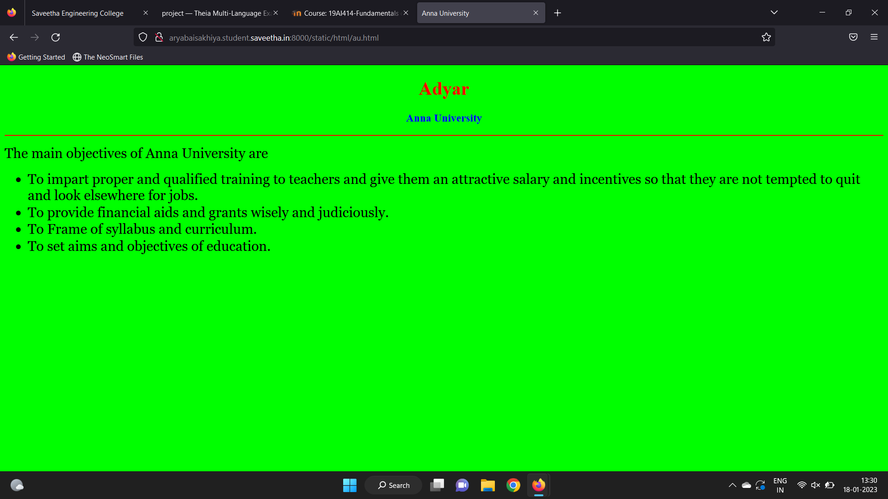

# Places Around Me
## AIM:
To develop a website to display details about the places around my house.

## Design Steps:

### Step 1:
Clone the github repository and create Django admin interface

### Step 2:
Use an image as clickable and execute the programs

## Code:
```
Map.html

<!DOCTYPE html>
<html lang="en">
<head>
<title>My City</title>
</head>
<body>
<h1 align="center">
<font color="red"><b>Adyar </b></font>
</h1>
<h3 align="center">
<font color="blue"><b>Arya Baisakhiya(22006077)</b></font>
</h3>
<center>

<map name="MyCity">
<area shape="circle" coords="" href="/static/html/ts.html" title="Theosophical Society">
<area shape="rectangle" coords="230,30,260,60" href="/static/html/gnp.html" title="Guindy National Park">
<area shape="circle" coords="400,350,50" href="/static/html/bp.html" title="Birla Planetarium">
<area shape="circle" coords="400,200,75" href="/static/html/au.html" title="Anna University">
<area shape="rectangle" coords="490,150,870,320" href="/static/html/ar.html" title="Adyar River">
</map>
</center>
</body>
</html>

ar.html
<!DOCTYPE html>
<html lang="en">
<head>
<title>Adyar River</title>
</head>
<body bgcolor="orange">
<h1 align="center">
<font color="red"><b>Adyar</b></font>
</h1>
<h3 align="center">
<font color="blue"><b>Adyar River</b></font>
</h3>
<hr size="3" color="red">
<p align="justify">
<font face="Georgia" size="5">
The uses of Adyar River  in Chennai are 
<ol type="1">
<li>Lake is used for rain water harvesting.</li>
<li>It is used for drinking.</li>
<li>Pisculture.</li>
<li>For bathing, washing clothes etc.</li>
</ol>
</font>
</p>
</body>
</html>
au.html
<!DOCTYPE html>
<html lang="en">
<head>
<title>Anna University</title>
</head>
<body bgcolor="lime">
<h1 align="center">
<font color="red"><b>Adyar</b></font>
</h1>
<h3 align="center">
<font color="blue"><b>Anna University</b></font>
</h3>
<hr size="3" color="red">
<p align="justify">
<font face="Georgia" size="5">
The main objectives of  Anna University are 
<ul>
<li>To impart proper and qualified training to teachers and give them an attractive salary and incentives so that they are not tempted to quit and look elsewhere for jobs.</li>
<li>To provide financial aids and grants wisely and judiciously.</li>
<li>To Frame of syllabus and curriculum.</li>
<li>To set aims and objectives of education.</li>
</ul>
</font>
</p>
</body>
</html>
bp.html
<!DOCTYPE html>
<html lang="en">
<head>
<title>Birla Planetarium</title>
</head>
<body bgcolor="pink">
<h1 align="center">
<font color="red"><b>Adyar</b></font>
</h1>
<h3 align="center">
<font color="blue"><b>Birla Planetarium</b></font>
</h3>
<hr size="3" color="red">
<p align="justify">
<font face="Arial" size="5">
<b>B. M. Birla Planetarium is a large planetarium in Chennai providing a virtual tour of the night sky and holding cosmic shows on a specially perforated hemispherical aluminium inner dome. The fifth B. M. Birla planetarium in the country,[1] it is located at Kotturpuram in the Periyar Science and Technology Centre campus which houses eight galleries, namely, Physical Science, Electronics and Communication, Energy, Life Science, Innovation, Transport, International Dolls and Children and Materials Science, with over 500 exhibits. Built in 1988 in the memory of the great industrialist and visionary of India B. M. Birla, it is the most modern planetarium in India. 
</b>
</font>
</p>
</body>
</html>
ts.html
<!DOCTYPE html>
<html lang="en">
<head>
<title>Theosophical Society</title>
</head>
<body bgcolor="cyan">
<h1 align="center">
<font color="red"><b>Adyar</b></font>
</h1>
<h3 align="center">
<font color="blue"><b>Theosophical Society</b></font>
</h3>
<hr size="3" color="red">
<p align="justify">
<font face="Courier New" size="5">
<b>
The Theosophy Society was founded by Helena Petrovna Blavatsky and others in 1875. The designation 'Adyar' is sometimes added to the name to make it clear that this is the Theosophical Society headquartered there, after the American section and some other lodges separated from it in 1895, under William Quan Judge
</b>
</font>
</p>
</body>
</html>
```

## Output:




## HTML Validator


## Result:
The program executed successfully